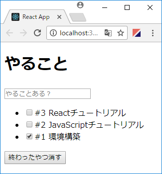

# とりあえずざくっと書いてみる

これから作るものはシンプルなToDoリストのUIだ。
ざくっと`src/index.js`に書いて、とりあえずChromeで表示してみよう。

`src/index.js`の中身を消して次のコードを書いてみて。

```js
import React from 'react';
import ReactDOM from 'react-dom';

const render = () => {
    ReactDOM.render(<App />, document.getElementById('root'));
};

const App = () => (
    <div>
        <h1>やること</h1>
        <p>
            <input type="text" placeholder="やることある？" />
        </p>
        <ul>
            <li>
                <label>
                    <input type="checkbox" />
                    <span>#3 Reactチュートリアル</span>
                </label>
            </li>
            <li>
                <label>
                    <input type="checkbox" />
                    <span>#2 JavaScriptチュートリアル</span>
                </label>
            </li>
            <li>
                <label>
                    <input type="checkbox" checked="checked" />
                    <span>#1 環境構築</span>
                </label>
            </li>
        </ul>
        <p>
            <button>終わったやつ消す</button>
        </p>
    </div>
);

render();
```

Chromeには次のような画面が表示されるはず。



これからこの画面に対して次のような修正をしていく。

* ToDoを配列で持つようにする
* 新しいToDoを追加できるようにする
* チェックを付けたり外したりできるようにする
* ボタンをすとチェックを付けたToDoを消せるようにする
* コンポーネントを分割する
* ファイルを分割する
* Fluxを導入する
* React Routerを導入する

## ToDoを配列で持つようにする

まずはToDoを配列で持つように修正してみよう。
今は3つのToDoを`li`要素でハードコーディングしている。

ToDoは「やる内容を表すテキスト」と「やったかどうかを表すフラグ」を持っている。
また、`#1`というふうに表示されているIDを持っている。
これをクラスで表現してみよう。

```js
class Todo {
    constructor(id, content, done) {
        this.id = id;
        this.content = content;
        this.done = done;
    }
}
```

この`Todo`クラスのインスタンスを配列で持つようにする。

```js
//Hello, world!のときのmessageと同じ理由でletを使用している。
let todoList = [
    new Todo(3, '環境構築', false),
    new Todo(2, 'JavaScriptチュートリアル', false),
    new Todo(1, 'Reactチュートリアル', true)
];
```

`li`要素を`todoList`から組み立てよう。

```js
<ul>
    {todoList.map(todo => (
        <li key={todo.id}>
            <label>
                <input type="checkbox" checked={todo.done} />
                <span>#{todo.id} {todo.content}</span>
            </label>
        </li>
    ))}
</ul>
```

`Todo`クラスの配列である`todoList`を、`map`メソッドを使ってJSXで書かれた`li`要素へ変換している。

`li`要素に`key`という属性が付与されているが、これはReactがこの`li`要素を追跡するために必要なものだ。
このように配列をもとに複数の要素を書き出すような場合は可能な限り`key`属性を付けるようにしておこう。

これでToDoを配列で持つようになった。

## 新しいToDoを追加できるようにする

ToDoを配列で持つようにしたので、そこに新しいToDoを追加できるようにしよう。
テキストを`input`要素で入力し、`Enter`を押すと追加される、というUIにする。

まず、`input`要素に表示されるテキストを表す変数を導入する。

```js
//Hello, world!のときのmessageと同じ理由でletを使用している。
let content = '';
```

```js
<p>
    <input type="text" placeholder="やることある？" value={content} />
</p>
```

ここで書いている`value={content}`というコードはあくまでも変数`content`を`input`要素の`value`属性に設定するということだけを表すので、このコードで`input`要素への入力が`content`に代入されることはない。

`onChange`イベントを使用して`input`要素への入力を変数`content`へと反映させるようにしよう。

```js
const updateContent = event => {
    content = event.target.value;
    render();
};
```

```js
<p>
    <input type="text" placeholder="やることある？" value={content}
        onChange={updateContent} />
</p>
```

あとは`Enter`を押すとToDoの配列に追加すればよい。
`onKeyPress`イベントで`Enter`が押されたときに処理を行おう。

```js
<p>
    <input type="text" placeholder="やることある？" value={content}
        onChange={updateContent} onKeyPress={tryAddTodo}/>
</p>
```

```js
let idGenerator = 3;

const tryAddTodo = event => {
    if (content !== '' && event.key === 'Enter') {
        const id = ++idGenerator;
        const todo = new Todo(id, content, false);
        todoList = [todo, ...todoList];
        content = '';
        render();
    }
};
```

`todoList`を変更しているコードをよく見てみよう。

```js
todoList = [todo, ...todoList];
```

`todoList`へ新しい配列が代入されている。
右辺は全体が`[`と`]`で囲まれており、新しく作られた`todo`と`...todoList`というものが`,`で区切られている。

この`...todoList`の`...`はスプレッド演算子と言い、配列（またはオブジェクト）を展開するものだ。

### スプレッド演算子

ちょっとここでREPLを使ってスプレッド演算子の動作を見てみよう。
新しくコマンドプロンプトを起動して`node`と打ってREPLを起動しよう。

例として「3つの引数を受け取って合計して返す」関数を書いてみよう。

```js
const sum = (a, b, c) => a + b + c;
```

動きも確認してみよう。

```js
sum(1, 2, 3); //6

const x = 4, y = 5, z = 6;
sum(x, y, z); //15
```

ここで関数`sum`へ要素が3つの配列を渡したい場合、どのように書けるだろうか。

```js
const ns = [7, 8, 9];
//そのままは渡せない！（正確に言うと渡せるけど期待しない結果になる）
sum(ns); //'7,8,9undefinedundefined'
//煩雑すぎる！
sum(ns[0], ns[1], ns[2]); //24
```

こういうときに役立つのがスプレッド演算子だ。

```js
sum(...ns); //24
```

先ほど「配列を展開する」と述べた意味が体感できただろうか。

スプレッド演算子は配列リテラルでも使える。

```js
const ms = [3, 4, 5];
//これだと長さが3の配列で最後の要素が入れ子になった配列になってしまう！
[1, 2, ms]; //[1, 2, [3, 4, 5]]
//スプレッド演算子で展開すればよい
[1, 2, ...ms]; //[1, 2, 3, 4, 5]
```

スプレッド演算子は配列だけじゃなくてオブジェクトに対しても使えるんだけど、実際に出てきたときにまた話題にしよう。

それではREPLを閉じて画面作りに戻ろう。

## チェックを付けたり外したりできるようにする

各ToDoのチェックボックスへチェックを付けたり外したりできるように修正しよう。
テキスト入力と同じように、チェックを付けた・外したときのイベントをハンドリングしてデータを変更して再描画、という流れになる。

まずはイベントを受け取ろう。

```js
<li key={todo.id}>
    <label>
        <input type="checkbox" checked={todo.done}
            onChange={event => updateStatus(todo.id, event.target.checked)}/>
        <span>#{todo.id} {todo.content}</span>
    </label>
</li>
```

ToDoは複数あるので、どれが対象なのか分かるように`id`を渡して`updateStatus`関数を呼び出している。
第2引数にはチェック状態を渡している。

`updateStatus`関数では受け取った情報をもとにToDoリストの状態を更新する。

```js
const updateStatus = (id, done) => {
    todoList = todoList.map(todo => {
        if (todo.id === id) {
            return new Todo(todo.id, todo.content, done);
        }
        return todo;
    });
    render();
};
```

`todoList`を`map`メソッドで変換するが、対象の`todo`は渡された`done`で状態を変更している。
変更対象でなければそのまま`todo`を返して新しい`todoList`を作っている。

### Todoをリファクタリング

新しい`Todo`インスタンスを返しているコードは少し煩雑だ。

```
return new Todo(todo.id, todo.content, done);
```

第1引数も第2引数も`Todo`クラスのメンバを参照している。
この「`done`だけを変更して新しい`Todo`インスタンスを作る処理」は`Todo`クラスに持たせたほうがよさそうだ。

`Todo`クラスに`setDone`メソッドを追加する。

```js
class Todo {
    constructor(id, content, done) {
        this.id = id;
        this.content = content;
        this.done = done;
    }
    setDone(done) {
        return new Todo(this.id, this.content, done);
    }
}
```

`updateStatus`関数ではこの`setDone`メソッドを使うようにする。

```js
const updateStatus = (id, done) => {
    todoList = todoList.map(todo => {
        if (todo.id === id) {
            return todo.setDone(done);
        }
        return todo;
    });
    render();
};
```

コードが少しスッキリしたかな。

このリファクタリングでは「`done`の状態を変更する」処理を`Todo`クラスに持たせることで処理の詳細をカプセル化した。

もしかしたら、`if (todo.id === id)`も`Todo`クラスに持っていけば`map`メソッドに渡している関数をもっとシンプルにできるんじゃないか、という意見もあるだろう。

私は「`done`の状態を変える対象がどの`todo`なのか判断する責務」は`Todo`クラスではなく`updateStatus`関数が持った方が自然だと考えたので、このようなリファクタリングにした。

## ボタンを押すとチェックを付けたToDoを消せるようにする

さて、完了したToDoがいつまでも残っていても仕方がないので消せるようにしよう。
これまでと同じ要領でボタンが押されたイベントをハンドリングして、未完了のToDoだけの配列を変数`todoList`へ再代入した後に再描画をすればよい。

ここらで一度、コード例を見る前に自力で実装してみよう。

実装できたら答え合わせしよう。
コード例は次の通り。

```js
<p>
    <button onClick={clear}>終わったやつ消す</button>
</p>
```

```js
const clear = event => {
    todoList = todoList.filter(todo => todo.done === false);
    render();
};
```

### Todoリストをクラスで表現する

ここまで`Todo`インスタンスを配列で持っていたけれど、これをクラスにしよう。
型を大切にしているプログラマでもリストやマップなどのコレクションはそのまま使ってしまいがちだ。

抽象的なコレクション型で表現された状態をカプセル化して定義される具体的なコレクション型を「ファーストクラスコレクション」と呼ぶ。

それではコードを修正していこう。
まず、現在の表現である`Todo`の配列をメンバに持つクラスを定義しよう。

```js
class TodoList {
    constructor(list) {
        this.list = list;
    }
}
```

変数`todoList`に対して、

* 新しい`Todo`インスタンスの追加
* `id`を指定して`done`を変更
* 完了した`Todo`を除く

といった操作がされている。
これらを`TodoList`クラスのメソッドにする。

```js
class TodoList {
    constructor(list) {
        this.list = list;
    }
    add(todo) {
        return new TodoList([todo, ...this.list]);
    }
    setDone(id, done) {
        return new TodoList(this.list.map(todo => {
            if (todo.id === id) {
                return todo.setDone(done);
            }
            return todo;
        }));
    }
    clear() {
        return new TodoList(this.list.filter(todo => todo.done === false));
    }
}
```

あとは変数`todoList`を操作しているところを、`TodoList`のメソッドを使うように修正すればよい。

## ここまでのコード

更に`Todo`インスタンスのファクトリメソッドを定義した。
これにより`idGenerator`が`Todo`クラスへカプセル化された。

ここまでのコードを次に示す。

```js
import React from 'react';
import ReactDOM from 'react-dom';

class Todo {
    constructor(id, content, done) {
        this.id = id;
        this.content = content;
        this.done = done;
    }
    setDone(done) {
        return new Todo(this.id, this.content, done);
    }
    static idGenerator = 0;
    static create(content) {
        return new Todo(++Todo.idGenerator, content, false);
    }
}

class TodoList {
    constructor(list) {
        this.list = list;
    }
    static empty() {
        return new TodoList([]);
    }
    add(todo) {
        return new TodoList([todo, ...this.list]);
    }
    setDone(id, done) {
        return new TodoList(this.list.map(todo => {
            if (todo.id === id) {
                return todo.setDone(done);
            }
            return todo;
        }));
    }
    clear() {
        return new TodoList(this.list.filter(todo => todo.done === false));
    }
}

//Hello, world!のときのmessageと同じ理由でletを使用している。
let todoList = TodoList.empty()
    .add(Todo.create('環境構築').setDone(true))
    .add(Todo.create('JavaScriptチュートリアル'))
    .add(Todo.create('Reactチュートリアル'));

//Hello, world!のときのmessageと同じ理由でletを使用している。
let content = '';

const updateContent = event => {
    content = event.target.value;
    render();
};

const tryAddTodo = event => {
    if (content !== '' && event.key === 'Enter') {
        const todo = Todo.create(content);
        todoList = todoList.add(todo);
        content = '';
        render();
    }
};

const updateStatus = (id, done) => {
    todoList = todoList.setDone(id, done);
    render();
};

const clear = event => {
    todoList = todoList.clear();
    render();
};

const render = () => {
    ReactDOM.render(<App />, document.getElementById('root'));
};

const App = () => (
    <div>
        <h1>やること</h1>
        <p>
            <input type="text" placeholder="やることある？" value={content}
                onChange={updateContent} onKeyPress={tryAddTodo} />
        </p>
        <ul>
            {todoList.list.map(todo => (
                <li key={todo.id}>
                    <label>
                        <input type="checkbox" checked={todo.done}
                            onChange={event => updateStatus(todo.id, event.target.checked)} />
                        <span>#{todo.id} {todo.content}</span>
                    </label>
                </li>
            ))}
        </ul>
        <p>
            <button onClick={clear}>終わったやつ消す</button>
        </p>
    </div>
);

render();
```

https://github.com/team-cerezo/react-sample/tree/first-step
