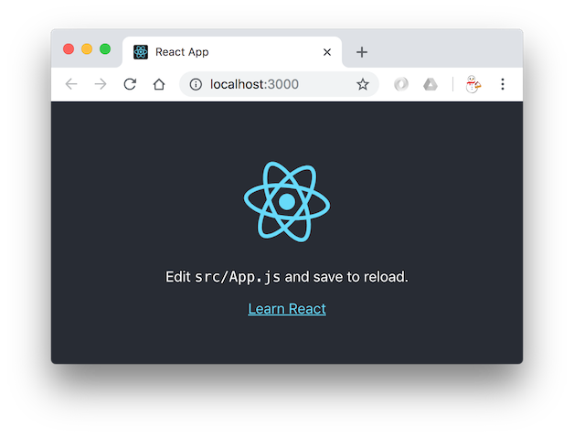

# プロジェクトを作る

`create-react-app`コマンドでプロジェクトを作る。
プロジェクトの名前を引数にしてコマンドを実行する。

```console
create-react-app todolist
```

コマンドの実行が終わると`todolist`というディレクトリができているので、`cd todolist`を実行してカレントディレクトリを移動しよう。

作られたプロジェクトにはサンプルコードも含まれている。
開発サーバーを起動して見てみよう。

```console
yarn start
```

少し間をおいて開発サーバーが起動し、自動でブラウザが起動されて http://localhost:3000/ を開く。
このとき、起動されたブラウザがChromeではない場合は手動でChromeを起動して http://localhost:3000/ を開くこと。



このような画面が確認できたら開発サーバーを`ctrl + C`で停止する。

`create-react-app`が生成したサンプルは開発を進める上では要らないものなので、`src`ディレクトリ以下のファイルをすべて消す。

`README.md`も消す。
ただし、作ったプロジェクトの概要や起動方法などを`README.md`に書いておくのはよい習慣なので自分なりに書いた`README.md`を置いておくとよい。
個人的に`README.md`の書き方は[わかりやすいREADME.mdを書く](https://deeeet.com/writing/2014/07/31/readme/)というブログ記事が参考になったので良かったら読んでみて。

## ファイル・ディレクトリの説明

|ファイル・ディレクトリ|説明|
|---|---|
|`.gitignore`|Gitの管理外にするファイル・ディレクトリを指定するためのファイル。このチュートリアルでは`create-react-app`が生成してくれるものを使う。|
|`README.md`|プロジェクトの概要や起動方法などを記載するファイル。|
|`node_modules`|yarnによってインストールされるパッケージたち。このディレクトリはGitの管理外にする。（`create-react-app`が生成してくれた`.gitignore`によって既に管理外に置かれている）|
|`package.json`|依存パッケージやビルドコマンドを記載するファイル。Mavenでいう`pom.xml`のようなもの。`pom.xml`と違って`package.json`には`scripts`にコマンドを書いて実行できる。そういう意味では`pom.xml`よりもGradleの`build.gradle`の方が似ている。|
|`public/favicon.ico`|Webページに設定されるアイコン。このチュートリアルでは`favicon.ico`については特に言及しないので好きなものに変えてもよい。|
|`public/index.html`|ブラウザで開くページ。このページからビルドされたjsファイルを読み込む。ブラウザのタブに表示|
|`public/manifest.json`|スマートフォンでWebサイトをアプリのように使う場合に使用されるメタ情報。このチュートリアルでは`manifest.json`については特に言及しない。|
|`src`|ソースコードを置くディレクトリ。|
|`yarn.lock`|yarnが依存パッケージのバージョンを固定するために使用するファイル。yarnが自動的に編集するファイルだがGitの管理下には置く。|
